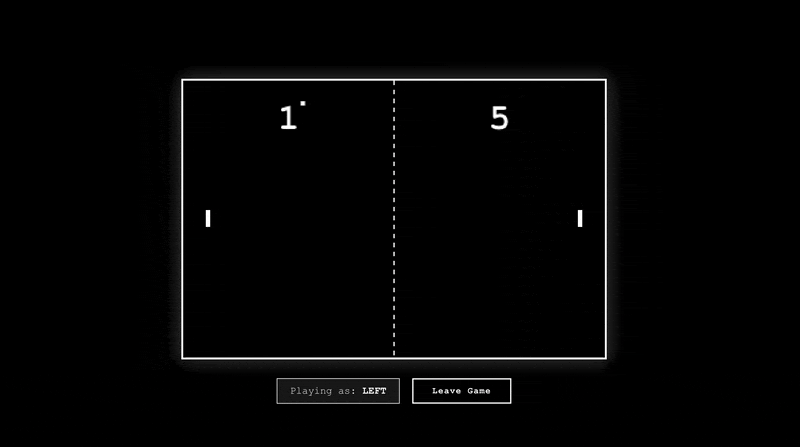

# 🏓 Pong with Centrifugo
<p align="center">
  <a href="https://pong.stabalmo.pro">
    
  </a>
  <a href="https://pong.stabalmo.pro">pong.stabalmo.pro</a>
</p>


## ✨ Features

- **Real-time Multiplayer** — Two players compete in classic Pong via WebSocket
- **Auto Disconnect Handling** — Games automatically end when players close browser or lose connection
- **Smart Presence** — Redis monitors active connections; seats free up on disconnect
- **Spectator Mode** — Watch live games with history playback
- **Modern Stack** — Go backend, vanilla JS frontend, Centrifugo v5 + Redis (ElasticSearch)

---

## 🏗️ Architecture

```
┌─────────────┐      WebSocket       ┌──────────────┐
│   Frontend  │ ◄──────────────────► │  Centrifugo  │
│  (Vanilla)  │                      │    (v5)      │
└─────────────┘                      └──────┬───────┘
                                            │
                  ┌──────────────────┬──────┴─────────────────┐
                  │                  │                        │
            ┌─────▼─────┐      ┌──────▼────────────┐    ┌─────▼─────┐
            │  Backend  │      │  Redis            │    │   Pub/Sub │
            │   (Go)    │ ◄───►│ (ElasticSearch)   │◄───┤  Presence │
            └───────────┘      └───────────────────┘    └───────────┘
```

**Flow:**
1. Players connect → Centrifugo (JWT auth)
2. Game state → Backend RPC calls
3. Disconnect events → Redis pub/sub → Backend
4. Presence monitor → Redis keys → Auto-clear seats

---

## 📖 Documentation

**[→ Technical Architecture Guide](https://github.com/PongCentrifugo/.github/blob/main/TECHNICAL-ARCHITECTURE.md)** — In-depth documentation on how Centrifugo, Redis, and Backend work together

---

## 🚀 Quick Start

### Prerequisites
- Docker & Docker Compose
- Go 1.22+ (for local development)
- Node.js 18+ (for frontend dev)

### Start Services

```bash
# Clone required repos
git clone https://github.com/PongCentrifugo/iac
git clone https://github.com/PongCentrifugo/backend
git clone https://github.com/PongCentrifugo/frontend

# 1. Redis
cd iac/redis
docker-compose up -d

# 2. Centrifugo
cd ../centrifugo
cp config.example.json config.json
# Edit secrets in config.json
docker-compose up -d

# 3. Backend
cd ../../backend
cp .env.example .env
# Match secrets with Centrifugo
docker-compose up -d

# 4. Frontend
cd ../frontend
npm install
npm run dev
```

**Play:** Open `http://localhost:5173`

---

## 🎮 How to Play

1. **Join** — Click "Join First" or "Join Second"
2. **Wait** — Game starts when both players ready
3. **Move** — Arrow keys or W/S to control paddle
4. **Score** — First to 10 wins
5. **Disconnect** — Close browser → game ends automatically

---

## 📁 Project Structure

```
pong-centrifugo/
├── pong-frontend/        # Vanilla JS + Vite
│   ├── src/
│   │   ├── game.js       # Game engine (canvas)
│   │   ├── centrifugo.js # WebSocket client
│   │   └── config.js     # API/WS endpoints
│   └── index.html
│
├── pong-backend/         # Go REST + RPC
│   ├── cmd/pong-api/
│   ├── internal/
│   │   ├── disconnect/   # Redis presence & pub/sub
│   │   ├── game/         # Lobby & game logic
│   │   ├── centrifugo/   # JWT tokens & publish
│   │   └── http/         # Handlers & RPC
│   └── go.mod
│
└── iac/                  # Infrastructure
    ├── redis/            # Redis broker
    └── centrifugo/       # WebSocket server
```

---

## 🔧 Configuration

### Centrifugo (Redis Engine)
```json
{
  "engine": "redis",
  "redis_address": "redis://pong-redis:6379/0",
  "presence": true,
  "join_leave": true
}
```

### Backend (Env)
```bash
REDIS_URL=redis://pong-redis:6379/0
REDIS_PUBSUB_PATTERN=centrifugo.*
REDIS_PRESENCE_INTERVAL=2s
CENTRIFUGO_API_URL=http://localhost:8000/api
```

---

## 🧪 Testing

```bash
# Backend unit tests
cd pong-backend
go test ./...

# Integration test (requires services running)
# Join two players, close one browser tab → game ends
```

---

## 🌟 Key Features Explained

### Disconnect Detection (Dual Strategy)

1. **Redis Pub/Sub** — Instant leave events from Centrifugo
2. **Presence Monitor** — Polls Redis every 2s for stale connections

**Why both?** Pub/sub catches clean disconnects; presence catches crashes/network failures.

### Game End Conditions

- ✅ Player scores 10 goals
- ✅ Player calls `/leave` endpoint
- ✅ Player closes browser / loses connection
- ✅ Player refreshes page

All cases → Lobby resets, history cleared.

---

## 📊 Channels

| Channel | Access | Purpose |
|---------|--------|---------|
| `pong_public:lobby` | Anonymous | Game events, spectators |
| `pong_private:first` | JWT | Player 1 enemy moves |
| `pong_private:second` | JWT | Player 2 enemy moves |

---

## 🛠️ Development

### Add Feature
```bash
# Backend: Add handler in internal/http/
# Frontend: Update game.js or centrifugo.js
# IaC: Modify docker-compose.yml
```

### Debug
- **Backend logs:** `docker logs pong-api -f`
- **Centrifugo:** `http://localhost:8000/` (admin panel)
- **Redis:** `docker exec pong-redis redis-cli MONITOR`


---

## 📝 License

See [MIT License](./LICENSE).

---

## 🤝 Contributing

Pull requests welcome! For major changes, open an issue first.
If you like this project, please ⭐ the repo, follow it, and follow my GitHub: [@Stabalmo](https://github.com/Stabalmo).

**Created by:** [Danila Alferov](https://www.linkedin.com/in/stabalmo)

---

**Built with ❤️ using Centrifugo, Go, and vanilla JavaScript**
